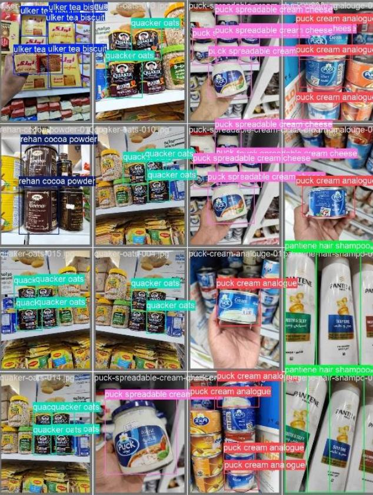
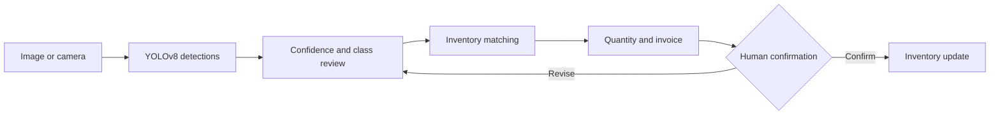

  

Concept illustration. Actual project material appears below.

# Smart Cashier

**Grocery recognition connected to a reviewable checkout.**

A vision assisted prototype that detects products, matches them to inventory, and prepares an invoice in Saudi riyals. Stock changes require human confirmation.

> **My contribution:** I captured and cleaned images for the custom dataset, annotated products in YOLO format, trained and tuned the detector and its thresholds, and integrated inference into Streamlit.
>
> **Context:** Collaborative university team project.
>
> **Public edition:** Product and engineering case study. Team source, trained checkpoint, and inventory artifacts remain private.

<table>
  <tr>
    <td align="center"><strong>39</strong> grocery classes</td>
    <td align="center"><strong>9</strong> catalogue categories</td>
    <td align="center"><strong>YOLOv8</strong> custom detector</td>
    <td align="center"><strong>Human review</strong> before purchase</td>
  </tr>
</table>

## Detection examples

  

The catalogue covers products found in Saudi supermarkets. Similar packaging, flavour variants, reflections, occlusion, and repeated items make recognition challenging.

## Checkout workflow

| Decision | Purpose |
| --- | --- |
| Review before purchase | A person checks predicted products and quantities |
| Exact and fuzzy matching | Reconciles detector labels with inventory names |
| Visible unmatched items | Exposes products that cannot be matched |
| Cached inference resources | Avoids reloading the model and inventory on every interface action |
| Delayed inventory changes | Applies stock updates only after final confirmation |

## Reported detector results

**Original training run, internal validation split.**

| Metric | Value |
| --- | ---: |
| mAP@0.5 | **0.9696** |
| mAP@0.5:0.95 | **0.7620** |
| Precision | 0.9238 |
| Recall | 0.9492 |

These are detection metrics on the original validation split. They do not measure the probability of a correct checkout. Evaluation covered single products in frame; basket accuracy with repeated items and occlusion has not been established.

mAP@0.5 uses an IoU threshold of 0.5. mAP@0.5:0.95 averages results across stricter overlap thresholds as well. Reporting both gives a fuller picture of localization performance.

| Training setting | Value |
| --- | --- |
| Base weights | `yolov8s.pt` |
| Image size | 640 |
| Epochs | 50 |
| Batch | 16 |
| Framework | Ultralytics 8.3.129 |

A separate shelf evaluation set with precision, recall, and confusion analysis for each class remains future work.

<strong>Explore the 39 class product catalogue</strong>

| Category | Classes | Examples |
| --- | ---: | --- |
| Grains | 8 | Abu Kas rice, Indomie, Goody spaghetti, Kuwaiti all purpose flour |
| Dairy products | 6 | Puck spreadable cream cheese, Almarai cooking cream, Anchor powdered milk |
| Hot drinks | 5 | Al Kbous tea, Al Ahmed tea, Nescafe, Nesquik, Rehan cocoa powder |
| Baking | 5 | Al Osra fine sugar, Lusine sliced bread, Dream Whip, Alalali corn flour |
| Sweets and snacks | 4 | Nutella, Ulker tea biscuit, 7 Days cake bars |
| Juice | 4 | Almarai apple, mango, mixed fruit, fruit cocktail |
| Soft drinks | 4 | Kinza cola, orange, cranberry, diet |
| Sauces and spices | 2 | Noor cooking oil, Baidar natural vinegar |
| Cleaning essentials | 1 | Pantene shampoo |

Several classes differ only by flavour on similar packaging. The categories also contain unequal numbers of classes. Aggregate metrics do not establish uniform performance across the catalogue.

## Documented verification

The preserved source baseline was reviewed on **29 July 2026** without submitting a purchase.

| Check | Reported result |
| --- | --- |
| Python compilation | Passed |
| Required imports | Passed |
| YOLO checkpoint loading | Passed |
| Streamlit health endpoint | HTTP 200 |
| Inventory changes during verification | None |

These checks establish a limited runtime checkpoint. They do not verify a completed purchase or the correctness of inventory updates.

## Constraints and next steps

| Current constraint | Planned work |
| --- | --- |
| Evaluation uses the original validation split | Create a versioned shelf evaluation set and publish results for each class |
| CSV storage lacks transactional guarantees | Introduce transactional inventory storage |
| Transaction history and rollback are absent | Add receipt history, rollback, and audit events |
| Matching depends on inventory naming consistency | Improve the separation of catalogue and model configuration |
| The checkpoint recognizes the original custom classes | Make the supported catalogue explicit in deployment configuration |

The interface uses **Streamlit** and the detector uses **Ultralytics YOLOv8**. Source, model licensing, and data rights require review before distribution or deployment.

## Public scope and licensing

This repository documents the workflow, architecture, reported results, verification boundary, and roadmap. The complete team source, checkpoint, and inventory baseline remain private while data rights, model licensing, and contributor approval are reviewed.

Ultralytics YOLOv8 is distributed under **AGPL-3.0**. Its licensing terms and any applicable commercial licensing requirements must be considered before product deployment. This public case study does not grant a license to the private team artifacts.

  Mohammed Yousef Rasheed · <a href="https://github.com/CUDA-Expert">GitHub</a> · <a href="https://www.linkedin.com/in/mohammed-rasheed-ai/">LinkedIn</a>

