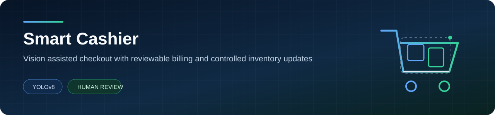
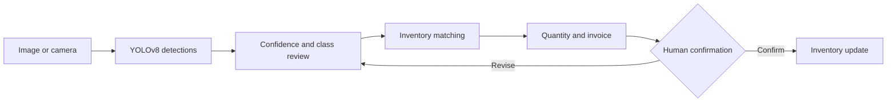

  

  
  
  

A vision assisted checkout prototype that detects grocery products, connects
them to inventory, and builds a reviewable invoice before any stock value
changes.

> Developed collaboratively as a university team project. This repository is
> the public product and engineering case study; source, checkpoint, and
> inventory artifacts remain private.

## Product idea

Retail recognition is harder than detecting a product against a clean
background. Shelves introduce occlusion, repeated items, reflections, similar
packaging, scale changes, and inconsistent lighting.

Smart Cashier treats model output as a suggestion inside a controlled workflow,
not as permission to modify inventory automatically.

<table>
  <tr>
    <td align="center"><strong>39</strong> grocery classes</td>
    <td align="center"><strong>YOLOv8</strong> custom detector</td>
    <td align="center"><strong>Human review</strong> before purchase</td>
    <td align="center"><strong>Saudi riyals</strong> invoice output</td>
  </tr>
</table>

## Checkout flow

## Engineering decisions

| Decision | Why it matters |
| --- | --- |
| Human confirmation | Predictions remain suggestions until the basket is reviewed |
| Exact and fuzzy matching | Model labels can be reconciled with inventory names |
| Visible unmatched items | Unknown products are shown instead of silently mispriced |
| Cached inference resources | The model and inventory are not reloaded on every interface action |
| Delayed inventory mutation | Stock changes happen only after final confirmation |

## Verified state

The preserved source baseline was reviewed on 29 July 2026 without submitting a
purchase.

| Check | Result |
| --- | --- |
| Python compilation | Passed |
| Required imports | Passed |
| YOLO checkpoint loading | Passed |
| Streamlit health endpoint | HTTP 200 |
| Inventory mutation during verification | None |

## Current constraints

1. CSV storage is a prototype, not a transactional inventory database.
2. Matching depends on consistency between detector classes and inventory names.
3. Transaction history and rollback are not yet implemented.
4. Model results require one reconciled evaluation report before public metric claims.
5. The checkpoint is tied to the original custom grocery classes.

## Public and private boundary

This public repository documents the product workflow, architecture, verified
state, constraints, and roadmap. The full team source, trained checkpoint, and
inventory baseline remain in a private development repository while data rights,
model licensing, and contributor approval are reviewed.

## Roadmap

1. Create a versioned shelf level evaluation set.
2. Publish per class precision, recall, and confusion analysis.
3. Replace CSV mutation with transactional storage.
4. Add receipt history, rollback, and audit events.
5. Separate model configuration from interface code.
