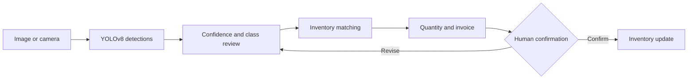

  

  
  
  

A vision assisted checkout prototype that detects grocery products, connects
them to inventory, and builds a reviewable invoice before any stock value
changes.

> Developed collaboratively as a university team project. This repository is
> the public product and engineering case study; source, checkpoint, and
> inventory artifacts remain private.

## Product idea

Retail recognition is harder than detecting a product against a clean
background. Shelves introduce occlusion, repeated items, reflections, similar
packaging, scale changes, and inconsistent lighting.

Smart Cashier treats model output as a suggestion inside a controlled workflow,
not as permission to modify inventory automatically.

<table>
  <tr>
    <td align="center"><strong>39</strong> grocery classes</td>
    <td align="center"><strong>YOLOv8</strong> custom detector</td>
    <td align="center"><strong>Human review</strong> before purchase</td>
    <td align="center"><strong>Saudi riyals</strong> invoice output</td>
  </tr>
</table>

## Detector results

Reported from the validation split of the original training run.

| Metric | Value |
| --- | --- |
| mAP@0.5 | **0.9696** |
| mAP@0.5:0.95 | **0.7620** |
| Precision | 0.9238 |
| Recall | 0.9492 |

The gap between the two mAP figures is the honest part. At a 0.5 IoU threshold
the detector finds the right product almost every time; held to stricter
localisation it drops by about 21 points. For a checkout that reads *which*
product is present rather than exactly where its edges fall, the first number is
the operational one, but quoting it alone would overstate the model.

| Training setting | Value |
| --- | --- |
| Base weights | `yolov8s.pt` |
| Image size | 640 |
| Epochs | 50 |
| Batch | 16 |
| Framework | Ultralytics 8.3.129 |

## Product catalogue

39 fine-grained classes grouped into 9 coarse categories, built around products
actually stocked in Saudi supermarkets rather than a generic retail set.

| Category | Classes | Examples |
| --- | ---: | --- |
| Grains | 8 | Abu Kas rice, Indomie, Goody spaghetti, Kuwaiti all purpose flour |
| Dairy products | 6 | Puck spreadable cream cheese, Almarai cooking cream, Anchor powdered milk |
| Hot drinks | 5 | Al Kbous tea, Al Ahmed tea, Nescafe, Nesquik, Rehan cocoa powder |
| Baking | 5 | Al Osra fine sugar, Lusine sliced bread, Dream Whip, Alalali corn flour |
| Sweets and snacks | 4 | Nutella, Ulker tea biscuit, 7 Days cake bars |
| Juice | 4 | Almarai apple, mango, mixed fruit, fruit cocktail |
| Soft drinks | 4 | Kinza cola, orange, cranberry, diet |
| Sauces and spices | 2 | Noor cooking oil, Baidar natural vinegar |
| Cleaning essentials | 1 | Pantene shampoo |

Two properties of this catalogue drive the hard cases. Several classes differ
only by flavour on near-identical packaging, which is a fine-grained
classification problem wearing a detection costume. And the category
distribution is heavily uneven, with eight grain classes against one cleaning
class, so per-category performance cannot be assumed uniform from an aggregate
score.

## Checkout flow

## Engineering decisions

| Decision | Why it matters |
| --- | --- |
| Human confirmation | Predictions remain suggestions until the basket is reviewed |
| Exact and fuzzy matching | Model labels can be reconciled with inventory names |
| Visible unmatched items | Unknown products are shown instead of silently mispriced |
| Cached inference resources | The model and inventory are not reloaded on every interface action |
| Delayed inventory mutation | Stock changes happen only after final confirmation |

## Verified state

The preserved source baseline was reviewed on 29 July 2026 without submitting a
purchase.

| Check | Result |
| --- | --- |
| Python compilation | Passed |
| Required imports | Passed |
| YOLO checkpoint loading | Passed |
| Streamlit health endpoint | HTTP 200 |
| Inventory mutation during verification | None |

## Current constraints

1. CSV storage is a prototype, not a transactional inventory database.
2. Matching depends on consistency between detector classes and inventory names.
3. Transaction history and rollback are not yet implemented.
4. The figures above come from the training run's own validation split. A
   separate shelf-level evaluation set, with per-class precision, recall, and
   confusion analysis, has not been produced yet.
5. The checkpoint is tied to the original custom grocery classes.
6. Detection is evaluated on single products in frame. Basket-level accuracy,
   where occlusion and repeated items dominate, is not the same measurement.

## Licensing note

The detector is built on Ultralytics YOLOv8, which is distributed under
**AGPL-3.0**. That licence reaches any derived work that is conveyed or offered
over a network, so any commercial deployment of this system would need either a
full source release under the same terms or a commercial licence from
Ultralytics. This is recorded here because it constrains how the prototype could
be productised, not as an afterthought to resolve later.

## Public and private boundary

This public repository documents the product workflow, architecture, verified
state, constraints, and roadmap. The full team source, trained checkpoint, and
inventory baseline remain in a private development repository while data rights,
model licensing, and contributor approval are reviewed.

## Roadmap

1. Create a versioned shelf level evaluation set.
2. Publish per class precision, recall, and confusion analysis on that set.
3. Replace CSV mutation with transactional storage.
4. Add receipt history, rollback, and audit events.
5. Separate model configuration from interface code.
